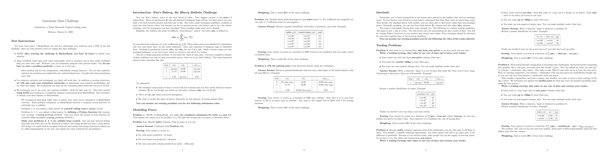

# Limestone Data Challenge 2026

> Full problem statement: [`data/limestone_data_challenge_2026.pdf`](data/limestone_data_challenge_2026.pdf)



A 3650×53 price matrix with ~50% missing values. Six columns are "index" columns (convex combinations of "farmer" columns). The challenge: identify indices, recover coefficients, complete the matrix, and build trading strategies.

### Challenge Overview

You run a bakery buying flour from *m* farmers at varying daily prices, published in a newspaper bulletin. Some prices are smudged (NaN). The bulletin also includes *n* index columns — convex combinations of farmer prices — but column identities are unknown.

| Problem | Task | Weight |
|---------|------|--------|
| 1a | Identify which columns are indices | 25% |
| 1b | Recover index decomposition coefficients | 5% |
| 2 | Fill all missing values in the matrix | 15% |
| 3 | Buy 100kg from NaN columns, minimize cost | 15% |
| 4 | Arbitrage: buy NaN, sell to index, maximize profit | 20% |
| 5 | Limit orders on NaN columns with price + quantity | 20% |

## Project Structure

```
Tower/
├── data/
│   ├── limestone_data_challenge_2026.data.csv   # raw input (3650 rows × 53 cols + time)
│   ├── limestone_data_challenge_2026.pdf        # full problem statement
│   └── challenge_pages.png                      # problem statement rendered as image
├── answers/                                      # generated outputs
│   ├── problem1a_answer.csv                      # column classification (farmer vs index)
│   ├── problem1b_answer.csv                      # index decomposition coefficients
│   └── problem2_answer.csv                       # fully completed matrix
├── problem-1_2/                                  # index detection + matrix completion
│   ├── pipeline.py                               # full pipeline (runs everything)
│   ├── candidates.py                             # phase 1: index detection via row-residual test
│   ├── coefficients.py                           # phase 2: NNLS coefficient recovery + constraint propagation
│   ├── matrix.py                                 # phase 3: iterative SVD completion (torch)
│   ├── trend.py                                  # periodic trend fitting (Lomb-Scargle + OLS harmonics)
│   ├── em.py                                     # standalone EM refinement (optional)
│   ├── intermediates/                            # cached results
│   │   ├── candidates.json                       # detected index/farmer column lists
│   │   ├── coefficients.json                     # raw decomposition weights (pre-EM)
│   │   ├── em_coefficients.json                  # refined decomposition weights (post-EM)
│   │   └── matrix.json                           # SVD rank sweep results + best rank
│   └── analysis/                                 # diagnostic plots
│       ├── residuals.png                         # bar chart: all columns ranked by convex-fit RMSE
│       ├── gaps.png                              # sorted RMSE + gap ratios between consecutive columns
│       ├── em_convergence.png                    # EM loop: verify RMSE, SVD RMSE, coef delta per iteration
│       └── trend_fits.png                        # per-column periodic trend fits vs observed data
├── problem-3_4/                                  # buying + arbitrage strategies
│   ├── buy.py                                    # trading_problem_3: buy 100kg cheapest
│   └── trade.py                                  # trading_problem_4: arbitrage
├── problem-5/                                    # limit-order buying
│   ├── pipeline.py                               # compute σ + backtest
│   ├── trade.py                                  # trading_problem_5: optimal bidding (classification inlined)
│   ├── compute_sigma.py                          # standalone σ computation (also available via pipeline)
│   └── intermediates/
│       └── sigma.json                            # precomputed per-column σ values
├── compact.py                                    # notebook generator
├── limestone_data_challenge_2026.ipynb           # submission notebook (generated)
└── requirements.txt                              # Python dependencies
```

## Results

| Problem | Metric | Value |
|---------|--------|-------|
| **1a** | Indices detected | 6/6 correct (col_11, col_30, col_42, col_46, col_48, col_50) |
| **1b** | Coefficient sum | 1.0000 for all 6 indices |
| **1b** | Verify RMSE (co-observed) | < 0.01 for proven indices |
| **2** | SVD obs RMSE | 0.0181 (rank 47) |
| **3** | Cost vs oracle (3650 rows) | 56,169,176 / 56,169,176 — **100% oracle-hit rate** |
| **3** | Out-of-time cost/oracle | 106,095 / 100,927 — **5.1% above oracle** (7 synthetic rows) |
| **4** | Profit vs oracle (3650 rows) | 5,064,153 / 5,064,153 — **100% capture rate** |
| **4** | Out-of-time profit | 4,966 / 10,769 oracle (46%) |
| **5** | Fill rate (500 training rows) | 473/500 (**94.6%**) |
| **5** | Total score (profit) | 453,574 |
| **5** | Avg profit / day | 907.1 |

## Problems & Approaches

### Problem 1a — Index vs Farmer Classification

**Goal:** Identify which of the 53 columns are "index" columns (convex combinations of others).

**Approach:** For each column, greedily build a predictor set from its most correlated columns while maintaining sufficient co-observed rows. Fit a convex combination (non-negative weights summing to 1) on a train split, measure RMSE on a test split. True indices have near-zero test RMSE; farmers have high RMSE. A threshold of 3.5 cleanly separates the two groups.

**Result:** 6 index columns detected: `col_11`, `col_30`, `col_42`, `col_46`, `col_48`, `col_50`.

### Problem 1b — Coefficient Recovery

**Goal:** For each index column, recover the non-negative coefficients (summing to 1) expressing it as a convex combination of farmer columns.

**Approach:** Iterative rank-and-peel using multiple NNLS methods:
- Method A: NNLS on co-observed rows (original data)
- Method B: NNLS on constraint-filled data
- Method C: Greedy forward selection
- Method D: Farmer-only pool variants

Each method's result is verified via convex re-fit. Best result per column is accepted. An EM loop (SVD completion → re-regression) refines uncertain coefficients. Index-to-index dependencies are resolved via `distribute_through` to express everything in terms of pure farmer columns.

### Problem 2 — Matrix Completion

**Goal:** Fill all ~96,000 missing values.

**Approach:** Three-stage warm start followed by iterative SVD:
1. **Constraint propagation:** deterministically fill ~3,000 cells from proven index decompositions
2. **Trend model:** fit per-column periodic trends (Lomb-Scargle dominant period detection + OLS harmonic regression with up to 5 harmonics, BIC model selection for single vs double period)
3. **Iterative SVD:** rank-47 (= number of farmers) SVD completion using PyTorch, warm-started from steps 1+2

Final reconstruction enforces index constraints exactly and preserves all original observations.

### Problem 3 — Buy 100kg

**Goal:** Given a row with NaN prices, buy exactly 100kg from NaN-priced columns to minimize cost.

**Approach:**
- **Historical rows (t ≤ 3649):** look up predicted prices from the Problem 2 completed matrix
- **Out-of-time rows:** algebraic fills from decomposition constraints, then KNN (k=20) + low-rank SVD projection (rank 12), blended 50/50

Buy all 100kg from the single cheapest predicted NaN column.

### Problem 4 — Arbitrage

**Goal:** Buy from a NaN column and sell to an index column to maximize profit, up to 100kg.

**Approach:** Same price prediction as Problem 3. Find the cheapest NaN column (source) and the most expensive index column (destination). If dest > src, trade 100kg.

### Problem 5 — Limit-Order Buying

**Goal:** Place limit orders (price + quantity) on NaN columns. Orders fill only if bid ≥ true price. Score = Σ(qty × (median - bid) × I{fill}).

**Approach:**
- **Per-column uncertainty (σ):** estimated via leave-one-out cross-validation — hide one observed value, predict it via KNN+low-rank, record error. σ_j = std(errors). Precomputed and saved to `intermediates/sigma.json`.
- **Cell classification:** each NaN cell is tagged as algebraic (σ ≈ 0.02) or SVD-imputed (σ capped at 3.0 for historical, inflated 1.5× for out-of-time).
- **Optimal bid:** maximize E[profit/kg] = (median − bid) × Φ((bid − p̂) / σ) via bounded scalar optimization.
- **Allocation:** 100kg on best column for historical rows; spread across top 3 for out-of-time.

**Backtest result:** 94.6% fill rate, avg profit 907/day on 500 training rows.

## How to Run

### Prerequisites

```bash
pip install -r requirements.txt
```

### Step 1: Run the full pipeline (Problems 1 & 2)

```bash
cd problem-1_2
python3 pipeline.py --intermediates
```

This generates:
- `answers/problem1a_answer.csv` — column classifications
- `answers/problem1b_answer.csv` — decomposition coefficients
- `answers/problem2_answer.csv` — completed matrix
- `problem-1_2/intermediates/candidates.json` — detected index/farmer lists
- `problem-1_2/intermediates/coefficients.json` — raw decomposition weights (pre-EM)
- `problem-1_2/intermediates/em_coefficients.json` — refined weights (post-EM)
- `problem-1_2/intermediates/matrix.json` — SVD rank + obs RMSE
- `problem-1_2/analysis/*.png` — diagnostic plots

Runtime: ~2–5 minutes depending on hardware.

### Step 2: Run Problem 5 pipeline

```bash
cd problem-5
python3 pipeline.py                  # compute σ in memory, run backtest
python3 pipeline.py --intermediates  # also save intermediates/sigma.json
```

Without `--intermediates`: computes σ, builds cache, runs backtest — nothing written to disk.
With `--intermediates`: also saves `problem-5/intermediates/sigma.json` for standalone `trade.py` use.

Runtime: ~15 seconds.

### Step 3: Test trading strategies

```bash
# Problem 3 — buy strategy
cd problem-3_4
python3 buy.py

# Problem 4 — arbitrage
python3 trade.py

# Problem 5 — limit-order buying
cd ../problem-5
python3 trade.py
```

### Run everything from scratch

```bash
cd problem-1_2 && python3 pipeline.py --intermediates
cd ../problem-5 && python3 pipeline.py --intermediates
cd ../problem-3_4 && python3 buy.py && python3 trade.py
cd ../problem-5 && python3 trade.py
```

### Generate submission notebook

```bash
python3 compact.py
```

Produces `limestone_data_challenge_2026.ipynb`.

## Key Dependencies

| Package | Purpose |
|---------|---------|
| numpy | Linear algebra, array operations |
| pandas | Data I/O, DataFrames |
| scipy | NNLS, Lomb-Scargle, minimize_scalar, normal CDF |
| torch | GPU-accelerated iterative SVD (falls back to CPU) |
